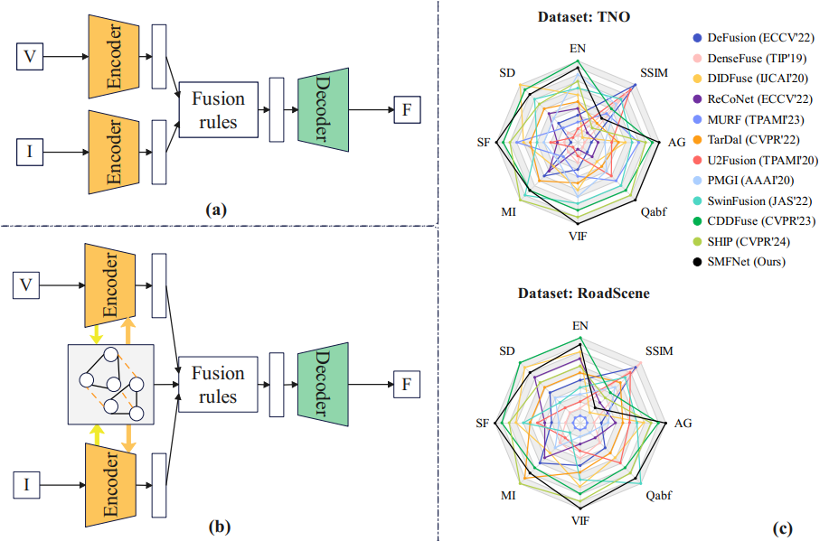
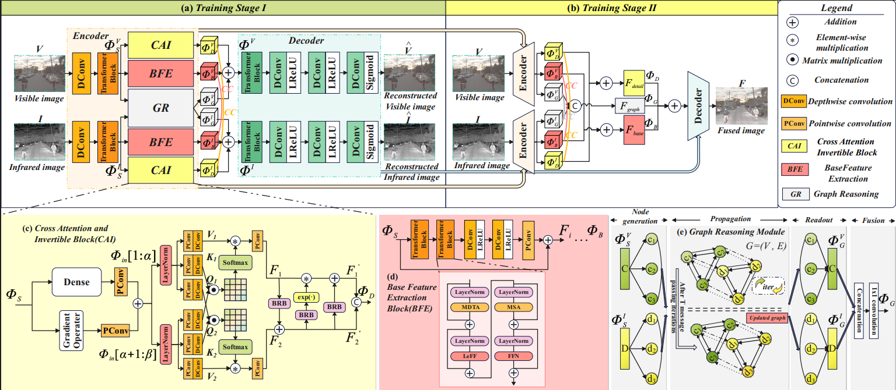

# A Semantic-Aware and Multi-Guided Network for Infrared-Visible Image Fusion
[Xiaoli Zhang](https://zhangxiaolijlu.github.io/), [Liying Wang](https://blog.csdn.net/weixin_46202235), [Libo Zhao](), [Xiongfei Li]() and [Siwei Ma](https://idm.pku.edu.cn/en/info/1009/1017.htm)

-[*[ArXiv]*](https://arxiv.org/abs/2407.06159)
## 🌟 Update
- [2024/6] The original manuscript was uploaded to arXiv.
- [2024/8] The manuscript has been submitted to IEEE Transactions on Multimedia.
- [2025/5] We have received the acceptance notification😊

## 📚 Abstract

To tackle the problem of the neglect of inter-feature relationships, high-frequency information loss, and the limited attention to downstream tasks, this paper focuses on how to model correlation-driven decomposing features and reason high-level graph representation by efficiently extracting complementary information and aggregating multi-guided features. We propose a three-branch encoder-decoder architecture along with corresponding fusion layers as the fusion strategy. Firstly, shallow features from individual modalities are extracted by a depthwise convolution layer combined with the transformer block. In the three parallel branches of the encoder, Cross Attention and Invertible Block (CAI) extracts local features and preserves high-frequency texture details. Base Feature Extraction Module (BFE) captures long-range dependencies and enhances modality-shared information. Graph Reasoning Module (GR) is introduced to reason high-level cross-modality relations and simultaneously extract low-level detail features as CAI's modality-specific complementary information.

<div align="center">
  
</div>

<div align="center">
  
</div>


### 🚀 Training
**1. Virtual Environment**
```
# create virtual environment
conda create -n SMFNet python=3.8.0
conda activate SMFNet
# select the pytorch-gpu version yourself
# install SMFNet requirements
pip install -r requirements.txt
```
**2. Training Dataset**

Download the MSRS dataset from [this link](https://github.com/Linfeng-Tang/MSRS) and place it inside your main project folder in the ``'./MSRS_train/'``.

**3. Pre-Processing**

Run 
```
python dataprocessing.py
``` 
and the processed training dataset is in ``'./data/MSRS_train_imgsize_128_stride_200.h5'``. This processing way is the same as CDDFuse.

**4. Training**

Run 
```
python train.py
``` 
and the trained model is available in ``'./models/'``.

### Testing

**1. Pretrained models**

Pretrained model is available in ``'./models/model_IVF.pth'```, which is responsible for the Infrared-Visible Fusion (IVF) task. 

**2. Test datasets**

The test datasets includes ``'./test_img/RoadScene'``, ``'./test_img/TNO'`` and ```./test_img/MSRS``` for IVF are the same as CDDFuse's test sets, ``'./test_img/MRI-CT'``, ``'./test_img/MRI-PET'`` and ``'./test_img/MRI-SPECT'`` for MIF. Due to the limited number of pages, we only show MRI-PET fusion results in the paper. 


**3. Results in Our Paper**

If you want to use our SMFNet and obtain the fusion results in our paper, please run 
```
python test.py
```
which can match the results in our original paper.

## 📝 Citation

```
@article{zhang2024semantic,
  title={A Semantic-Aware and Multi-Guided Network for Infrared-Visible Image Fusion},
  author={Zhang, Xiaoli and Wang, Liying and Zhao, Libo and Li, Xiongfei and Ma, Siwei},
  journal={arXiv preprint arXiv:2407.06159},
  year={2024}
}
```
## 😊 Any question

If you have any question, please feel free to contact with [Liying Wang](https://blog.csdn.net/weixin_46202235) at `my_lnnu@163.com` or `liyingw23@gmails.jlu.edu.cn`.


## 💡Acknowledgements

The codes are based on [CDDFuse](https://github.com/Zhaozixiang1228/MMIF-CDDFuse), [DeepMiH](https://github.com/TomTomTommi/DeepMIH), [IGNet](https://github.com/lok-18/IGNet), and [MGDN](https://github.com/Guanys-dar/MGDN). Please also follow their licenses. Thanks for their awesome work. Additionally, if you are attracted by [PromptFusion](https://github.com/hey-it-s-me/PromptFusion), please also refer to their papers. We also appreciate Dr. [Xihang Hu](https://github.com/hu-xh)'s thoughtful review and suggestions.

